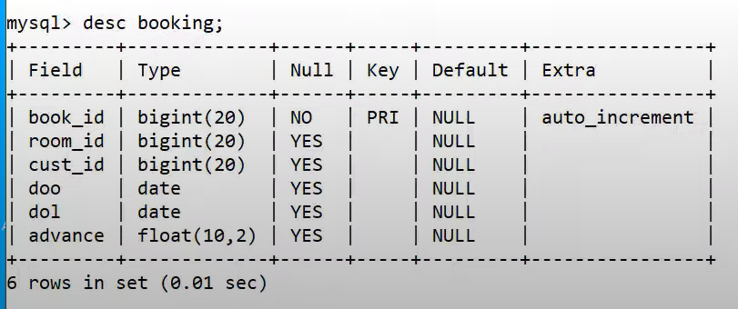

# Hotel-Managment-System
This Project on Hotel Management is a software developed (using Python and MySql) to simplify hotel operations by automating them.
It covers major aspects of hotel management; it could perform the following operations- Hotel Booking, Provide you with Hotel Rooms Info, Room Service, Billing and Record-Keeping.

#images-of-the-project

